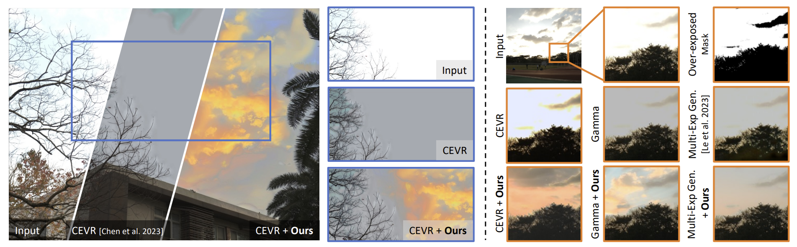

# HDR Reconstruction Boosting with Training-Free and Exposure-Consistent Diffusion

This project is built upon [DiffusionLight](https://diffusionlight.github.io/)



Single LDR to HDR reconstruction remains challenging for over-exposed regions where traditional methods often fail due to complete information loss. We present a training-free approach that enhances existing indirect HDR reconstruction methods through diffusion-based inpainting. Our method combines text-guided diffusion models with SDEdit refinement to generate plausible content in over-exposed areas while maintaining consistency across multi-exposure LDR images. Unlike previous approaches requiring extensive training, our method seamlessly integrates with existing indirect HDR reconstruction techniques through an iterative compensation mechanism that ensures luminance coherence across multiple exposures. We demonstrate significant improvements in both perceptual quality and quantitative metrics on standard HDR datasets and in-the-wild captures. Results show that our method effectively recovers natural details in challenging scenarios while preserving the advantages of existing HDR reconstruction pipelines.

 ## Table of contents
-----
  * [Installation](#Installation)
  * [Preprocess](#Preprocess)
  * [Inference](#Inference)
------

## Environment

We use python 3.11, CUDA 11.7 and torch 2.0.1 as our develop environment.

## Installation

To setup the Python environment, you need to run the following commands in both Conda and pip:

```shell
conda env create -f environment.yml
conda activate boor
pip install -r requirements.txt
```

Note that Conda is optional. However, if you choose not to use Conda, you must manually install CUDA-toolkit and OpenEXR.

## Preprocess

### 0. Preparing the image and your baseline

Any size will be OK.
Choose any single LDR to HDR reconstruction method you like. 

Be aware the folder structure should be like: ./dataset/case/\[0-1-2-3\].png


### 1. Preparing the over-exposed mask

First, we predict the over-exposed mask with:

```shell
python utils/mask.py
```

This command outputs the corresponding over-exposed mask to the 0.png.
Please make sure you have modified the folder path.


### 2-a. (For indirect method) Generate inverse CRF

Next, we use debevec's method to generate the inverse CRF.

```shell
python utils/crf_est.py
```

### 2-b. (For direct method) Generate LDR stack
Since direct method doesn't have to estimate inverse CRF, we use gamma 2.2 as the inverse CRF.

```shell
python utils/hdr2gamma.py
```

### 3. Generate depth map
Then we need the depth map as the condition for the controlnet.

```shell
python utils/depth.py
```

### 4. Generate caption

```shell
python utils/image_caption_cogvlm.py
```

Now, there are 8 files in each case: 


```
.
└── case/
    ├── 0.png
    ├── -1.png
    ├── -2.png
    ├── -3.png
    ├── depth.png
    ├── mask.png
    ├── caption_cog.txt
    └── response.mat (only needed for indirect method)
```

## Inference

```shell
# for indirect method (with response.mat)
python inpaint_debevec.py
# for direct method 
python inpaint_control.py
```

